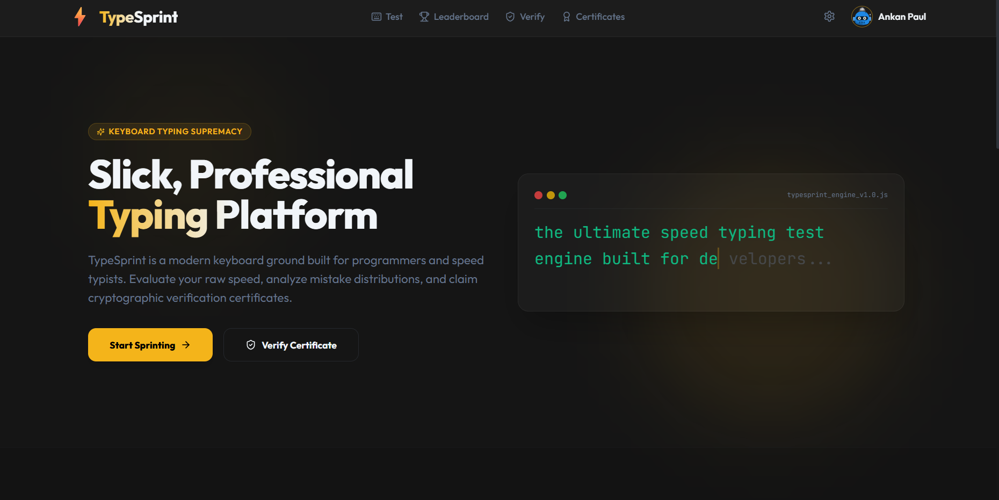
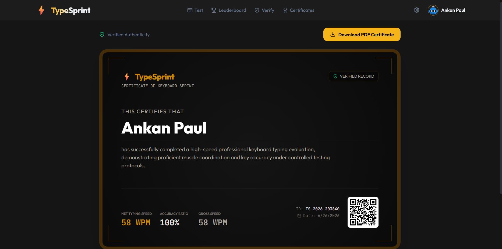
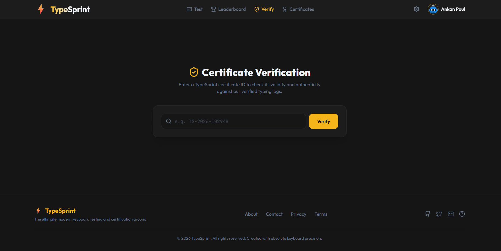
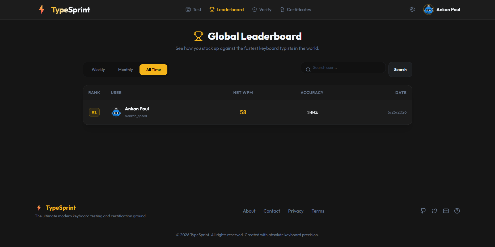
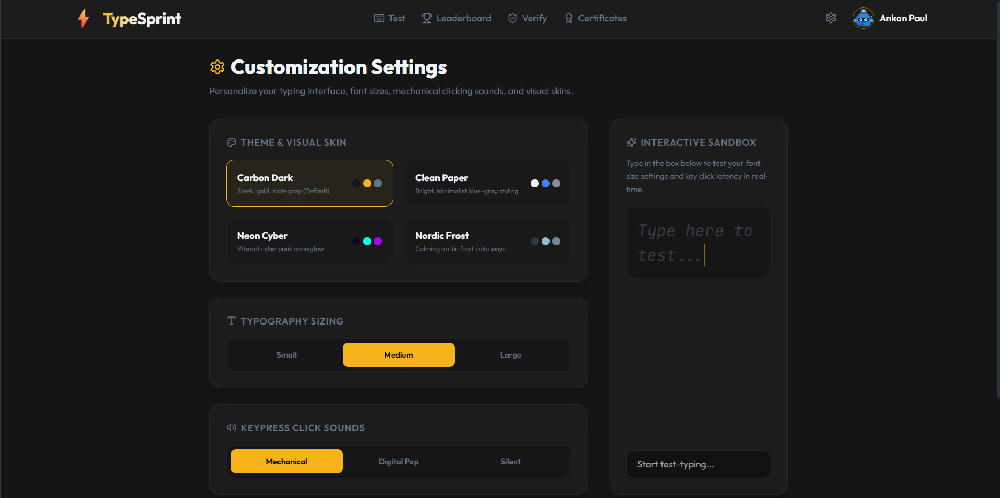
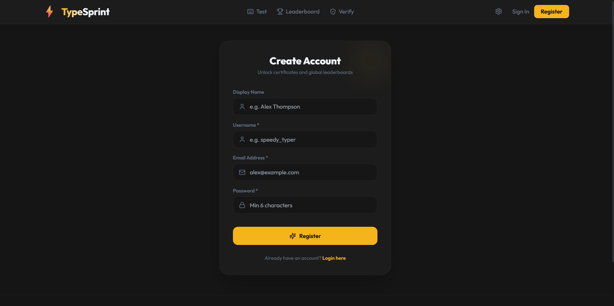

# ⌨️ TypeSprint

<div align="center">



<br>


**A modern full-stack typing speed test platform built with React, TypeScript, Express, Prisma, and MongoDB.**

Practice your typing, improve your speed and accuracy, compete on global leaderboards, and earn verifiable certificates.

</div>

---

## 🌟 Features

### 👤 Authentication

- Secure user registration & login
- JWT authentication
- Password hashing using bcrypt
- Persistent user sessions

### ⌨️ Typing Test

- Real-time WPM calculation
- Accuracy tracking
- Live typing statistics
- Clean distraction-free typing experience
- Instant performance analysis

### 📊 Dashboard

- Personal typing history
- Best WPM
- Average accuracy
- Overall performance statistics

### 🏆 Global Leaderboard

- Compare your typing speed with others
- Global rankings
- Performance-based leaderboard

### 📜 Certificate System

- Automatically generated typing certificates
- Downloadable certificate
- Unique certificate ID

### ✅ Certificate Verification

- Verify certificates using unique verification IDs
- Public verification page
- Prevent fake certificates
- Displays certificate owner, WPM, accuracy and issue date

### ⚙️ User Settings

- Update profile information
- Change password
- Manage account settings
- User preferences

### 🎨 Modern UI

- Beautiful dark theme
- Responsive design
- Smooth animations
- Mobile friendly
- Fast and lightweight

---

# 📸 Screenshots

## 🏠 Home

<p align="center">

</p>

---

## ⌨️ Typing Test

<p align="center">

</p>

---

## 🏆 Certificates & Verification

<p align="center">


</p>

---

## 📈 Leaderboard & Settings

<p align="center">


</p>

---

## 👤 Registration

<p align="center">

</p>

---

# 🛠️ Tech Stack

## Frontend

- React
- TypeScript
- Vite
- Tailwind CSS
- React Router
- Framer Motion
- Recharts

## Backend

- Node.js
- Express.js
- TypeScript
- Prisma ORM
- JWT Authentication
- bcrypt

## Database

- MongoDB Atlas

---

# 📂 Project Structure

```text
TypeSprint/
│
├── client/
│   ├── src/
│   ├── public/
│   └── package.json
│
├── server/
│   ├── prisma/
│   ├── src/
│   └── package.json
│
├── screenshots/
│
├── .gitignore
├── package.json
├── README.md
└── LICENSE
```

---

# 🚀 Getting Started

## Clone the Repository

```bash
git clone https://github.com/AP-49a/TypeSprint.git

cd TypeSprint
```

---

## Install Dependencies

### Client

```bash
cd client

npm install
```

### Server

```bash
cd ../server

npm install
```

---

## Configure Environment Variables

### Server (.env)

```env
DATABASE_URL=your_mongodb_connection_string
JWT_SECRET=your_secret_key
PORT=5000
```

### Client (.env)

```env
VITE_API_URL=http://localhost:5000
```

---

## Generate Prisma Client

```bash
cd server

npx prisma generate

npx prisma db push
```

---

## Start Backend

```bash
npm run dev
```

Runs on

```
http://localhost:5000
```

---

## Start Frontend

```bash
cd ../client

npm run dev
```

Runs on

```
http://localhost:5173
```

---

# 🌐 Deployment

### Frontend

- Vercel

### Backend

- Render

### Database

- MongoDB Atlas

---

# 🔐 Environment Variables

## Backend

| Variable | Description |
|----------|-------------|
| DATABASE_URL | MongoDB Atlas Connection String |
| JWT_SECRET | Secret used for JWT Authentication |
| PORT | Server Port |

## Frontend

| Variable | Description |
|----------|-------------|
| VITE_API_URL | Backend API URL |

---

# 🎯 Future Roadmap

- [ ] Multiplayer typing battles
- [ ] Friends & Challenges
- [ ] Public user profiles
- [ ] Daily typing challenges
- [ ] Achievement system
- [ ] Typing streaks
- [ ] Keyboard heatmap
- [ ] Custom typing tests
- [ ] Theme customization
- [ ] Google Authentication
- [ ] GitHub Authentication
- [ ] Country-wise Leaderboards
- [ ] Advanced Analytics

---

# 🤝 Contributing

Contributions are welcome!

If you'd like to improve **TypeSprint**, feel free to:

1. Fork the repository
2. Create a new feature branch
3. Commit your changes
4. Open a Pull Request

Bug reports, feature requests and improvements are always appreciated.

---

# ⭐ Show Your Support

If you like this project, consider giving it a ⭐ on GitHub.

It helps others discover the project and motivates future improvements.

---

# 👨‍💻 Creator

**Ankan Paul**

- GitHub: https://github.com/AP-49a

TypeSprint was designed, developed, and is maintained by **Ankan Paul**.

---

# 📄 License

This project is licensed under the MIT License.

---

<div align="center">

### Made with ❤️ using React, TypeScript, Express, Prisma & MongoDB

⭐ If you enjoyed this project, don't forget to leave a star!

</div>
